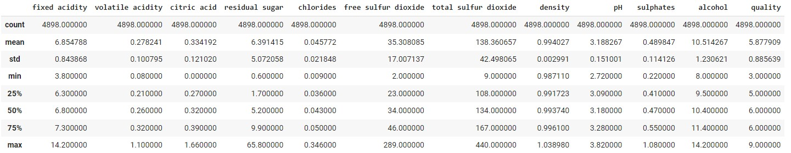

# White Wine Quality Prediction using Python and SciKitLearn


-----
[Repository Link](https://github.com/MarkStocksUK/White_Wine_Analysis)

-----
## Executive Summary
This project aimed to improve the quality of white wine by developing a predictive model that scores the quality based on physicochemical inputs. Using data from over four thousand Vinho Verde wines, I used Google Colab, Python, SciKit-Learn, pandas, NumPy, seaborn, and matplotlib to clean, analyse and explore the data.

I then compared the performance of four models: Logistical Regression, Decision Tree Classification, Random Forest Classification and Extra Trees Classification. The model can now take the physicochemical composition of the wine and predict whether it is “good”, “average” or “bad” with an accuracy of 98%.

-----
## Data Preprocessing

### Data Source
The dataset has been available for 15 years and contains data on 9999 Portuguese wines. I am focussing on the white wine data, as less work has been done with this data
([link to dataset](https://archive.ics.uci.edu/dataset/186/wine+quality)). The data was downloaded as a CSV, imported into Google Colab and then loaded into a Pandas dataframe using the `pd.read.csv` command.

### Initial Exploration
First up, a quick check on the data structure. 
  
  `wwdata.info()`
  


Next, some descriptive statistics, showing some big variances in the min and max for fields such as *residual sugar*, *free sulfur dioxide* and *total sulfur dioxide* 
  
  `wwdata.describe()`


 

### Missing and null values
The data was then checked for missing and null values. None were present.
  
  `sns.heatmap(wwdata.isnull(), yticklabels=False, cbar=True, cmap='mako')`
  

  
  `wwdata.isnull().sum()`
  


### Identifying and Handling Outliers
Outliers were identified using boxplots. These are not mistakes, but form a natural part of the data so we should keep them. To avoid distorting the results, we modify any low outliers to match the 1st quantile and any high outliers to match the 3rd quantile.
  
#### Outliers before modifications
  
#### Outliers after modifications
  

### Investigating the Quality column
As we will be trying to predict the quality of the wine, we should do some analysis on the *quality* column.
  
  `wwdata['quality'].unique()`

  

  `sns.countplot(x='quality', data=wwdata)`

  

We can see the key findings of the quality column are:
-	There are no wines rated 1, 2 or 10.
-	Most wines score in the 5-7 range.
  
This suggests we can split the wine quality into three bandings.
-	4 or lower = “Bad”
-	5-7 = “Average”
-	8 or higher = “Good”

-----
## Data Analysis
### Toolkit
Tools used in the analysis
- Google Colab
- Python
- Sci-Kit Learn
- Matplotlib
- Seaborn
- Pandas
- NumPy

### Correlation
Scatterplots were created for each of the variable pairings. Unfortunately, this provided no immediate insight into the relationship between the variables and the *quality* column.

  `sns.pairplot(data=wwdata, height=3)`
  
  

A correlation heatmap, however, gave more insight.

  `sns.heatmap(data=wwdata.corr(), annot=True)`
  
  

Key findings were:
-	The strongest positive correlation is between density and residual sugar.
-	The strongest negative correlation is between density and alcohol.
-	The alcohol variable has the strongest correlation with our target quality (0.44).

### Banding column
The quality scores were then grouped into bandings of "good, "average" and "bad". A count of the wines in each banding highlighted how unbalanced the data was.

  `Counter(wwdata['Banding'])`

  

92% of wines are in the "average" band. We could just create a model that predicts "average" and be correct 92% of the time. Cool. Job done!

Nah, let's do it properly.

### Handling unbalanced data
To counter this, the dataset was balanced by using an oversampling technique called SMOTE. This is a method of over-sampling the minority class by creating synthetic minority class examples. Following this we have a balanced dataset.

  `Counter(wwdata['Banding'])`

  

### Methods
First we split the data into features and target datasets.

```
x = wwdata.drop(['quality','Banding'], axis=1)
y = wwdata['Banding']
```

Next, we split these into train and test groups.

```
from sklearn.model_selection import train_test_split
x_train, x_test, y_train, y_test = train_test_split(x, y, test_size = 0.25)
```

And check the sizing after splitting.
```
print(x_train.shape)
print(y_train.shape)
print(x_test.shape)
print(y_test.shape)

(10203, 11)
(10203,)
(3402, 11)
(3402,)
```

Now we can use 4 different methods, to try and find the best predictive model.
#### Logistic Regression
```
from sklearn.linear_model import LogisticRegression
from sklearn.metrics import confusion_matrix, accuracy_score, classification_report
lr = LogisticRegression(max_iter=1000000)
lr.fit(x_train, y_train)
lr_predict = lr.predict(x_test)
lr_conf_matrix = confusion_matrix(y_test, lr_predict)
lr_acc_score = accuracy_score(y_test, lr_predict)
print('Confusion Matrix')
print(lr_conf_matrix)
print()
print('Classification report')
print(classification_report(y_test,lr_predict))
```

#### Decision Tree
```
from sklearn.tree import DecisionTreeClassifier
dt = DecisionTreeClassifier()
dt.fit(x_train, y_train)
dt_predict=dt.predict(x_test)
dt_conf_matrix = confusion_matrix(y_test, dt_predict)
dt_acc_score = accuracy_score(y_test, dt_predict)
print('Confusion Matrix')
print(dt_conf_matrix)
print()
print('Classification report')
print(classification_report(y_test, dt_predict))
```

#### Random Forest
```
from sklearn.ensemble import RandomForestClassifier
rf = RandomForestClassifier()
rf.fit(x_train, y_train)
rf_predict=rf.predict(x_test)
rf_conf_matrix = confusion_matrix(y_test, rf_predict)
rf_acc_score = accuracy_score(y_test, rf_predict)
print('Confusion Matrix')
print(rf_conf_matrix)
print()
print('Classification report')
print(classification_report(y_test, rf_predict))
```

#### Extra Trees
```
from sklearn.ensemble import ExtraTreesClassifier
et = ExtraTreesClassifier()
et.fit(x_train, y_train)
et_predict=et.predict(x_test)
et_conf_matrix = confusion_matrix(y_test, et_predict)
et_acc_score = accuracy_score(y_test, et_predict)
print('Confusion Matrix')
print(et_conf_matrix)
print()
print('Classification report')
print(classification_report(y_test, et_predict))
```

-----
## Results
After training the models, I output the confusion matrix and classification results for each to allow a clear comparison.

#### Logistic Regression
```
Confusion Matrix
[[516 264 342]
 [223 872  64]
 [236  35 850]]

Classification report
              precision    recall  f1-score   support

     average       0.53      0.46      0.49      1122
         bad       0.74      0.75      0.75      1159
        good       0.68      0.76      0.72      1121

    accuracy                           0.66      3402
   macro avg       0.65      0.66      0.65      3402
weighted avg       0.65      0.66      0.65      3402
```
66% Accuracy using the Logistic Regression model; worse than just randomly guessing "average" every time. It also required increasing the iterations to 1,000,000 to get convergence. The confusion matrix suggests a lot of incorrect predictions with lots of values outside of the diagonal. Onto the next model...

#### Decision Tree
```
Confusion Matrix
[[ 957   85   80]
 [  58 1097    4]
 [  47    3 1071]]

Classification report
              precision    recall  f1-score   support

     average       0.90      0.85      0.88      1122
         bad       0.93      0.95      0.94      1159
        good       0.93      0.96      0.94      1121

    accuracy                           0.92      3402
   macro avg       0.92      0.92      0.92      3402
weighted avg       0.92      0.92      0.92      3402
```
This is looking better, with more values along the diagonal and an accuracy score of 92% for the Decision Tree model.

#### Random Forest
```
Confusion Matrix
[[1047   39   36]
 [  17 1142    0]
 [   6    0 1115]]

Classification report
              precision    recall  f1-score   support

     average       0.98      0.93      0.96      1122
         bad       0.97      0.99      0.98      1159
        good       0.97      0.99      0.98      1121

    accuracy                           0.97      3402
   macro avg       0.97      0.97      0.97      3402
weighted avg       0.97      0.97      0.97      3402
```
97% accuracy using Random Forest, another improvement on the Decision Tree model and the confusion matrix is looking good too.

#### Extra Trees
```
Confusion Matrix
[[1059   38   25]
 [  12 1147    0]
 [   3    0 1118]]

Classification report
              precision    recall  f1-score   support

     average       0.99      0.94      0.96      1122
         bad       0.97      0.99      0.98      1159
        good       0.98      1.00      0.99      1121

    accuracy                           0.98      3402
   macro avg       0.98      0.98      0.98      3402
weighted avg       0.98      0.98      0.98      3402
```
98% accuracy using the Extra Trees model, further improvements, and an improved confusion matrix again.

### Extra Tress Confusion Matrix
Let's look closer at the confusion matrix. We will normalise the results to percentages to make it easier to compare classes and display it as a heatmap.
  
  
  
This highlights that the model is excellent at classifying good wines. Its worst performance is when it incorrectly classifies average wines as bad 3% of the time.

#### Extra Trees Feature Importance
  
  
  
Looking at the Feature Importance of the Extra Trees model shows that *alcohol* is the most important feature being used in the model. This backs up the relationship that was identified in the correlation heatmap findings earlier in the analysis.

-----
## Conclusion
The Extra Trees Classification model provided the most accurate (98%) way of predicting the quality of a white wine using its physicochemical properties as inputs.

-----
## Discussion and Recommendations
We have shown a good level of accuracy with the work, but we must always look for more opportunities.

### Future Project improvements
- Are there other datasets available, can we expand this to more than just the subset of Portuguese Vinho Verde wines?
- Can we improve performance further by using other modelling techniques?
- We should automate some of the data cleaning and preparation steps.

### Limitations of this project
-We have looked at the whole dataset, but in winemaking certain years are noted for their good wines. There is no year column in the dataset, if we had that we could also analyse if there was any variance in quality across the years.
- My data science knowledge is still limited, so it could be argued that I am a limitation on the project.
