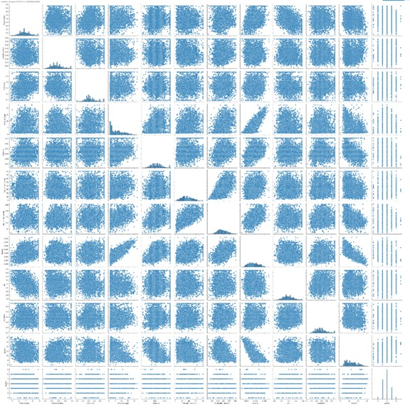

<h1 align="center">White Wine Quality Prediction using Python and SciKitLearn</h1>

[Repository Link](https://github.com/MarkStocksUK/White_Wine_Analysis)

-----
## Executive Summary
This project aimed to improve the quality of white wine by developing a predictive model that scores the quality based on physicochemical inputs. Using data from over four thousand Vinho Verde wines, I used Google Colab, Python, SciKit-Learn, pandas, NumPy, seaborn, and matplotlib to clean, analyse and explore the data.

I then compared the performance of four models: Logistical Regression, Decision Tree Classification, Random Forest Classification and Extra Trees Classification. The model can now take the physicochemical composition of the wine and predict whether it is “good”, “average” or “bad” with an accuracy of 98%.

-----
## Data Preprocessing

### Data Source
The dataset has been available for 15 years and contains data on 9999 Portuguese wines. I am focussing on the white wine data, as less work has been done with this data
[link to dataset](https://archive.ics.uci.edu/dataset/186/wine+quality). The data was downloaded as a CSV, imported into Google Colab and then loaded into a Pandas dataframe using the `pd.read.csv` command.

### Initial Exploration
First up, a quick check on the data structure. 
  
  `wwdata.info()`
  

Next, some descriptive statistics, showing some big variances in the min and max for fields such as *residual sugar*, *free sulfur dioxide* and *total sulfur dioxide* 
  
  `wwdata.describe()`

 

### Missing and null values
The data was then checked for missing and null values. None were present.
  
  `sns.heatmap(wwdata.isnull(), yticklabels=False, cbar=True, cmap='mako')`
  

  
  `wwdata.isnull().sum()`
  

### Identifying and Handling Outliers
Outliers were identified using boxplots. These are not mistakes, but form a natural part of the data so we should keep them. To avoid distorting the results, we modify any low outliers to match the 1st quantile and any high outliers to match the 3rd quantile.
  
#### Outliers before modifications
  
#### Outliers after modifications
  

### Investigating the Quality column
As we will be trying to predict the quality of the wine, we should do some analysis on the *quality* column.
  
  `wwdata['quality'].unique()`

  

  `sns.countplot(x='quality', data=wwdata)`

  

We can see the key findings of the quality column are:
-	There are no wines rated 1, 2 or 10.
-	Most wines score in the 5-7 range.
  
This suggests we can split the wine quality into three bandings.
-	4 or lower = “Bad”
-	5-7 = “Average”
-	8 or higher = “Good”

-----
## Data Analysis
### Toolkit
Tools used in the analysis
- Google Colab
- Python
- Sci-Kit Learn
- Matplotlib
- Seaborn
- Pandas
- NumPy

### Correlation
Scatterplots were created for each of the variable pairings. Unfortunately, this provided no immediate insight into the relationship between the variables and the *quality* column.

  `sns.pairplot(data=wwdata, height=3)`
  
  

A correlation heatmap, however, gave more insight.

  `sns.heatmap(data=wwdata.corr(), annot=True)`
  
  

Key findings were:
-	The strongest positive correlation is between density and residual sugar.
-	The strongest negative correlation is between density and alcohol.
-	The alcohol variable has the strongest correlation with our target quality (0.44).

### Banding column
The quality scores were then grouped into bandings of "good, "average" and "bad". A count of the wines in each banding highlighted how unbalanced the data was.

  `Counter(wwdata['Banding'])`

  

92% of wines are in the "average" band. We could just create a model that predicts "average" and be correct 92% of the time. Cool. Job done!

Nah, let's do it properly.

    ### Handling unbalanced data
    ### Methods

-----
  ## Results
